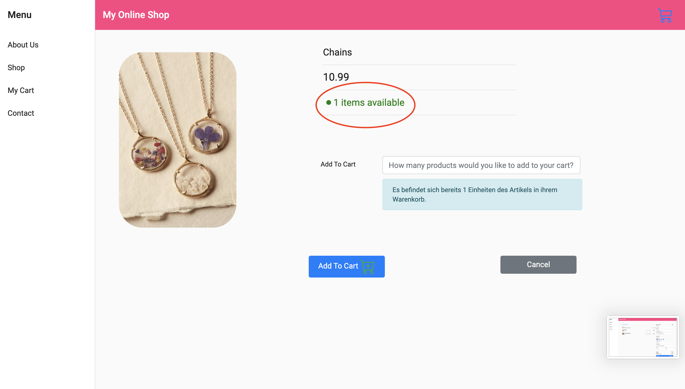
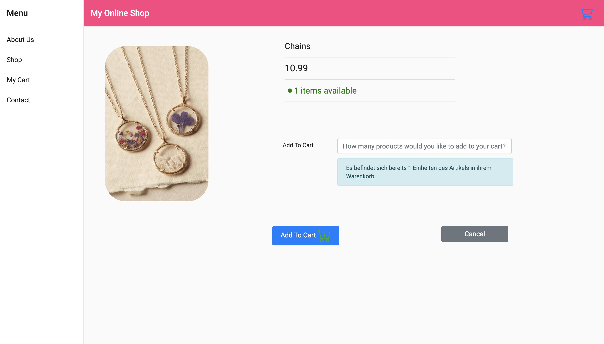

# My Online Shop

## About

* *Bei meiner Web-Applikation handelt es sich um einen Online Shop, in dem Schmuck verkauft wird. Die NutzerInnen haben die Möglichkeit, Artikel zum Warenkorb hinzuzufügen und zu löschen. Anschließend kann der Kauf abgeschlossen werden. Außerdem gibt es eine Suchfunktion, mit der man nach bestimmtem Schmuck suchen kann. Zudem ist es möglich, die Artikel im Warenkorb nach dem Preis zu sortieren.
Es werden alle vier CRUD-Funktionalitäten implementiert.*

## Inhalt

> * [Titel](#My-Online-Shop)
>   * [About](#about--synopsis)
>   * [Inhalt](#inhalt)
>   * [Installation](#installation)
>   * [Aufbau und Screenshots](#usage)
>     * [Screenshots](#screenshots)
>     * [Features](#features)
>   * [Schwierigkeiten und Problembehandlung](#code)
>     * [Content](#content)
>     * [Requirements](#requirements)
>     * [Limitations](#limitations)
>     * [Build](#build)
>     * [Deploy (how to install build product)](#deploy-how-to-install-build-product)
>   * [Resources (Documentation and other links)](#resources-documentation-and-other-links)
>   * [Contributing / Reporting issues](#contributing--reporting-issues)
>   * [License](#license)
>   * [About Nuxeo](#about-nuxeo)

## Installation

Sample:

* From the Nuxeo Marketplace: install [the Sample Nuxeo Package](https://connect.nuxeo.com/nuxeo/site/marketplace/package/nuxeo-sample).
* From the command line: `nuxeoctl mp-install nuxeo-sample`

## Usage

About-Us-Seite

Shop mit Artikeln

Mit der Maus über einen Artikel fahren

Einzelansicht eines Artikels:

* Dies ist die Einzelansicht eines Artikels. Von hier aus hat man die Möglichkeit,
zu sehen, wie viele Artikel noch verfügbar sind. Darüber hinaus kann man eine bestimmte Anzahl des Artikels zum Warenkorb hinzufügen oder aber auch einfach zurückgehen, indem man den 'Cancel'-Button betätigt.

Warenkorb:
* Dies ist die Warenkorbansicht. Hier ist es den UserInnen möglich, zu sehen, wie viele Artikel sich im Warenkorb befinden. Außerdem kann die Menge verändert werden, indem man den '-'/'+' - Button betätigt. Die Buttons werden den verfügbaren Mengen angepasst und entsprechend 'disabled'. Im unten aufgeführten Beispiel ist der Artikel 'Chains' nur noch einmal erhältlich. Dementsprechend ist auch der '+'-Button disabled. Wenn NutzerInnen einen Artikel aus dem Warenkorb vollständig entfernen möchten, so müssen sie dazu den Lösch-Button betätigen, der mit einem Mülleimer gekennzeichnet ist.
Der zu zahlende Betrag wird aus den Preisen der im Warenkorb befindlichen Artikel und ihrer Menge berechnet. Darüber hinaus werden bei Bestellungen unter 50 $ Versandkosten dazuberechnet. Diese fallen aus, wenn die Bestellung höhere Kosten aufweist.

Einzelansicht eines Artikels nachdem er zum Warenkorb hinzugefügt wurde:

* Wenn UserInnen einen Artikel erneut besichtigen, nachdem sie ihn zum Warenkorb hinzugefügt haben, werden sie darüber informiert.

Kaufabschluss

* Der Kauf wird abgeschlossen, indem der 'Checkout'-Button betätigt wird und das darüberliegende Formular ausgefüllt wird.
Anschließend wird man zu einer anderen Seite weitergeleitet, auf der man darüber benachrichtigt wird, dass der Kauf erfolgreich abgeschlossen wurde. Darüber hinaus wird die Adresse angezeigt, an die die Bestellung geliefert werden soll.
  

Nach Kaufabschluss

* Nach Kaufabschluss wird die verfügbare Menge der entsprechenden Artikel aktualisiert.
  
Artikel 'Chains' vor Kaufabschluss

Artikel 'Chains' nach Kaufabschluss

### Screenshots

### Features

## Schwierigkeiten und Problembehandlung

In meinem Projekt mussten zahlreiche Einzelheiten und Schwierigkeiten beachtet werden.
Ich habe mit zwei Datenbanken (Items im Shop und Warenkorb) gearbeitet, deren Datensätze voneinander abhängig waren.
So muss man beispielsweise, wenn man die Menge eines Artikels im Warenkorb erhöhen möchte, auch die Datenbank der im Shop erhältlichen Artikel im Hinterkopf behalten und prüfen, 
ob überhaupt genügend Artikel erhältlich sind. Wenn dies nicht der Fall ist, muss man auf das Problem entsprechend reagieren. Außerdem kann der 'Add To Cart'-Button bei der Einzelansicht eines Artikels von den UserInnen sowohl als 'Create'-,  als auch als 'Update'-Funktionalität genutzt werden. Auch Dinge wie diese musste ich bei der Entwicklung meiner Web-Applikation beachten.

Problembehandlung bei der Eingabe eines Buchstabens

Problembehandlung: nicht genügend Artikel verfügbar

Problembehandlung Warenkorb: Button disabled, wenn nicht genügend Artikel verfügbar sind

See [CORG/Compiling Nuxeo from sources](http://doc.nuxeo.com/x/xION)

Sample: <https://github.com/nuxeo/nuxeo/blob/master/nuxeo-distribution/README.md>

### Limitations

Sample: <https://github.com/nuxeo-archives/nuxeo-features/tree/master/nuxeo-elasticsearch>

### Build

    mvn clean install

Build options:

* ...

### Deploy (how to install build product)

Direct to MP package if any. Otherwise provide steps to deploy on Nuxeo Platform:

 > Copy the built artifacts into `$NUXEO_HOME/templates/custom/bundles/` and activate the `custom` template.

## Resources (Documentation and other links)

## Contributing / Reporting issues

Link to JIRA component (or project if there is no component for that project). Samples:

* [Link to component](https://jira.nuxeo.com/issues/?jql=project%20%3D%20NXP%20AND%20component%20%3D%20Elasticsearch%20AND%20Status%20!%3D%20%22Resolved%22%20ORDER%20BY%20updated%20DESC%2C%20priority%20DESC%2C%20created%20ASC)
* [Link to project](https://jira.nuxeo.com/secure/CreateIssue!default.jspa?project=NXP)

## License

[Apache License, Version 2.0](http://www.apache.org/licenses/LICENSE-2.0.html)

## About Nuxeo

Nuxeo Platform is an open source Content Services platform, written in Java. Data can be stored in both SQL & NoSQL databases.

The development of the Nuxeo Platform is mostly done by Nuxeo employees with an open development model.

The source code, documentation, roadmap, issue tracker, testing, benchmarks are all public.

Typically, Nuxeo users build different types of information management solutions for [document management](https://www.nuxeo.com/solutions/document-management/), [case management](https://www.nuxeo.com/solutions/case-management/), and [digital asset management](https://www.nuxeo.com/solutions/dam-digital-asset-management/), use cases. It uses schema-flexible metadata & content models that allows content to be repurposed to fulfill future use cases.

More information is available at [www.nuxeo.com](https://www.nuxeo.com).

#My Online Shop

*Bei meiner Web-Applikation handelt es sich um einen Online Shop, in dem Schmuck verkauft wird. Die NutzerInnen haben die Möglichkeit, Artikel zum Warenkorb hinzuzufügen und zu löschen. Anschließend kann der Kauf abgeschlossen werden. Es werden alle vier CRUD-Funktionalitäten implementiert.*

##Inhalt
1. Aufbau und Funktionsweise
1. Technologien
1. Leg jetzt los!

