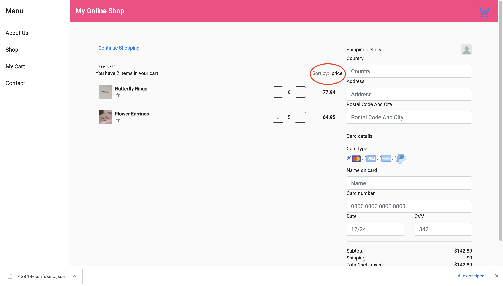
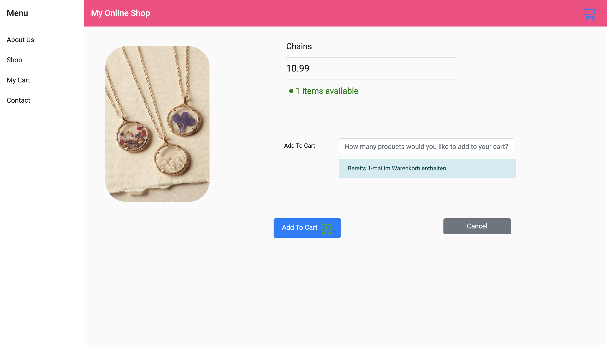

# My Online Shop

## About

* *Bei meiner Web-Applikation handelt es sich um einen Online Shop, in dem Schmuck verkauft wird. Die NutzerInnen haben die Möglichkeit, Artikel zum Warenkorb hinzuzufügen und zu löschen. Anschließend kann der Kauf abgeschlossen werden. Außerdem gibt es eine Suchfunktion, mit der man nach bestimmtem Schmuck suchen kann. Zudem ist es möglich, die Artikel im Warenkorb nach dem Preis zu sortieren.
Es werden alle vier CRUD-Funktionalitäten implementiert.*

## Inhalt

> * [My Online Shop](#My-Online-Shop)
>   * [About](#about--synopsis)
>   * [Inhalt](#inhalt)
>   * [Aufbau und Screenshots](#aufbau-und-screenshots)
>   * [Schwierigkeiten und Problembehandlung](#schwierigkeiten-und-problembehandlung)
>   * [Technologien](#technologien)

## Aufbau und Screenshots

### About-Us-Seite

### Shop mit Artikeln

* Mit der Maus über einen Artikel fahren

### Suchfunktion

* Treffer

* keine Treffer

### Einzelansicht eines Artikels

* Dies ist die Einzelansicht eines Artikels. Von hier aus hat man die Möglichkeit,
zu sehen, wie viele Artikel noch verfügbar sind. Darüber hinaus kann man eine bestimmte Anzahl des Artikels zum Warenkorb hinzufügen oder aber auch einfach zurückgehen, indem man den 'Cancel'-Button betätigt.

### Warenkorb
* Dies ist die Warenkorbansicht. Hier ist es den UserInnen möglich, zu sehen, wie viele Artikel sich im Warenkorb befinden. Außerdem kann die Menge verändert werden, indem man den '-'/'+' - Button betätigt. Die Buttons werden den verfügbaren Mengen angepasst und entsprechend 'disabled'. Im unten aufgeführten Beispiel ist der Artikel 'Chains' nur noch einmal erhältlich. Dementsprechend ist auch der '+'-Button disabled. Wenn NutzerInnen einen Artikel aus dem Warenkorb vollständig entfernen möchten, so müssen sie dazu den Lösch-Button betätigen, der mit einem Mülleimer gekennzeichnet ist.
Der zu zahlende Betrag wird aus den Preisen, der im Warenkorb befindlichen Artikel und ihrer Menge berechnet. Darüber hinaus werden bei Bestellungen unter 50 $ Versandkosten dazuberechnet. Diese fallen aus, wenn die Bestellung höhere Kosten aufweist.
Die  Artikel im Warenkorb können außerdem nach den Preisen sortiert werden.

* Bestellung mit Versandkosten

* Bestellung ohne Versandkosten

* Sortier-Funktionalität (vor dem Sortieren)

* Sortier-Funktionalität (nach dem Sortieren)

### Einzelansicht eines Artikels nachdem er zum Warenkorb hinzugefügt wurde:

* Wenn UserInnen einen Artikel erneut besichtigen, nachdem sie ihn zum Warenkorb hinzugefügt haben, werden sie darüber informiert.

### Kaufabschluss

* Der Kauf wird abgeschlossen, indem der 'Checkout'-Button betätigt wird und das darüberliegende Formular ausgefüllt wird.
Anschließend wird man zu einer anderen Seite weitergeleitet, auf der man darüber benachrichtigt wird, dass der Kauf erfolgreich abgeschlossen wurde. Darüber hinaus wird die Adresse angezeigt, an die die Bestellung geliefert werden soll.
  

### Nach Kaufabschluss

* Nach Kaufabschluss wird die verfügbare Menge der entsprechenden Artikel aktualisiert.
  
* Artikel 'Chains' vor Kaufabschluss

* Artikel 'Chains' nach Kaufabschluss

## Schwierigkeiten und Problembehandlung

In meinem Projekt mussten zahlreiche Einzelheiten und Schwierigkeiten beachtet werden.
Ich habe mit zwei Datenbanken (Items im Shop und Warenkorb) gearbeitet, deren Datenfelder voneinander abhängig waren.
So muss man beispielsweise, wenn man die Menge eines Artikels im Warenkorb erhöhen möchte, auch die Datenbank der im Shop erhältlichen Artikel im Hinterkopf behalten und prüfen, 
ob überhaupt genügend Artikel erhältlich sind. Wenn dies nicht der Fall ist, muss man auf das Problem entsprechend reagieren. Außerdem kann der 'Add To Cart'-Button bei der Einzelansicht eines Artikels von den UserInnen sowohl als 'Create'-,  als auch als 'Update'-Funktionalität genutzt werden. Auch Dinge wie diese musste ich bei der Entwicklung meiner Web-Applikation beachten.

Problembehandlung bei der Eingabe eines Buchstabens

Problembehandlung: nicht genügend Artikel verfügbar

Problembehandlung Warenkorb: Button disabled, wenn nicht genügend Artikel verfügbar sind

Problembehandlung: Suche ergab keine Treffer

404: Page Not Found

## Technologien

* Angular
* Node.js
* MySQL

